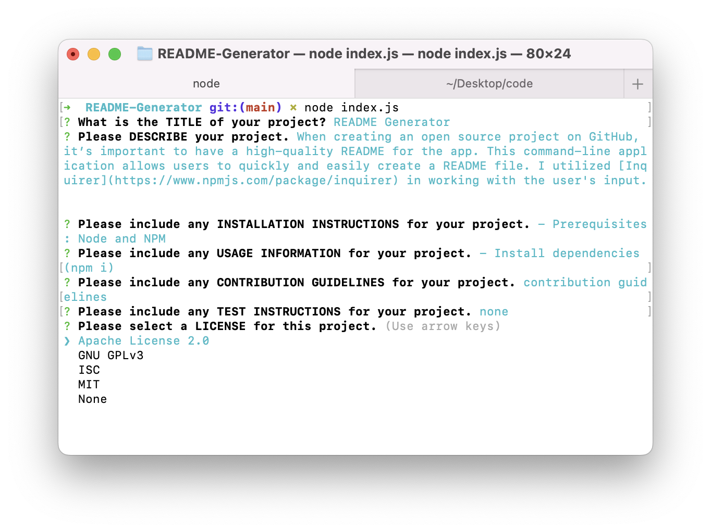

# README Generator

## Description
When creating an open source project on GitHub, it’s important to have a high-quality README for the app. This command-line application allows users to quickly and easily create a README file. I utilized [Inquirer](https://www.npmjs.com/package/inquirer) in working with the user's input.

## Table of Contents

- [Installation](#installation)
- [Usage](#usage)
- [Contributing](#contributing)
- [Questions](#questions)
- [License](#license)

## Installation

- Prerequisites: Node and NPM
- Clone this repository and CD into it
- Install dependencies (npm i)

## Usage
- Run node index.js
- Answer the prompts

## Screen Shot & Walkthrough video

[Walkthrough video that demonstrates the functionality]()

## Questions

If you have any questions please don't hesitate to reach out:
[Github](https://github.com/brianbixby)
[Email](mailto:brianbixby0@gmail.com)

## Technology

- [Github](https://github.com/brianbixby/README-Generator)
- [Nodejs](https://nodejs.org/en/)
- [Inquirer](https://www.npmjs.com/package/inquirer)
- [FS](https://nodejs.dev/learn/the-nodejs-fs-module)
- [Util](https://nodejs.org/api/util.html)

## License

Copyright 2022 Brian Bixby

Permission is hereby granted, free of charge, to any person obtaining a copy of this software and associated documentation files (the "Software"), to deal in the Software without restriction, including without limitation the rights to use, copy, modify, merge, publish, distribute, sublicense, and/or sell copies of the Software, and to permit persons to whom the Software is furnished to do so, subject to the following conditions:

The above copyright notice and this permission notice shall be included in all copies or substantial portions of the Software.

THE SOFTWARE IS PROVIDED "AS IS", WITHOUT WARRANTY OF ANY KIND, EXPRESS OR IMPLIED, INCLUDING BUT NOT LIMITED TO THE WARRANTIES OF MERCHANTABILITY, FITNESS FOR A PARTICULAR PURPOSE AND NONINFRINGEMENT. IN NO EVENT SHALL THE AUTHORS OR COPYRIGHT HOLDERS BE LIABLE FOR ANY CLAIM, DAMAGES OR OTHER LIABILITY, WHETHER IN AN ACTION OF CONTRACT, TORT OR OTHERWISE, ARISING FROM, OUT OF OR IN CONNECTION WITH THE SOFTWARE OR THE USE OR OTHER DEALINGS IN THE SOFTWARE.
